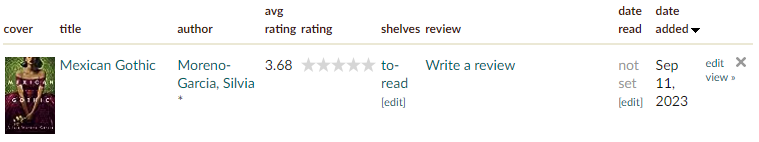
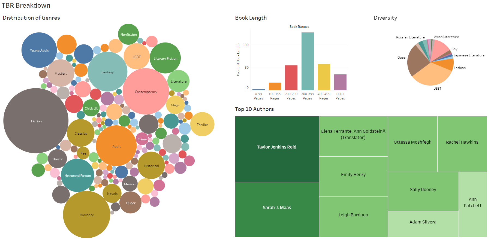

# TBR_Breakdown

## Introduction

I have always had a passion for reading, however, I, like many others, have a hard time finding the time to do so. And with the debut of BookTok, my list of books to read (TBR) is longer than ever. I wanted to see what kind of books I have been getting recommended from TikTok since I have been saving them all to my Goodreads, so I decided to put my new data analysis skills to the test.

## Web Scraping
To get this data, I thought I would try out web scraping. I needed data on each title, author, genre, and average rating, however, my Goodreads TBR page only displays the title, author, and average rating. 
 

 

How do I find the genres? I can’t just scrape the TBR page. However, when I looked at the HTML, I could scrape the URL of each title, which will take me to the book’s page where genres are located. Knowing this, I could outline my plan:

1. Create a function that will scrape each URL from my TBR and store it in a list called book_urls
2. Create another function that will process each URL, grabbing the title, author, genres, and average rating from Goodreads (I  will test this to see if each worked correctly), storing them in a data frame

The Jupyter notebooks containing this code are included in the repository under Web Scraping.ipynb and Splitting Genres.ipynb
 

## Tableau visualization - <a href="https://public.tableau.com/views/TBRBreakdown/TBRDashboard?:language=en-US&:display_count=n&:origin=viz_share_link">here</a>
After scraping and exporting my data, I created an interactive Tableau dashboard for this project to visualize trends in genre, book length, authors, and diversity. 

## Conclusion

The analysis of my TBR has yielded valuable insights into my reading preferences. The diversity of genres, including fiction, contemporary, romance, fantasy, and historical fiction, highlight types of books BookTok recommends and genres I appreciate. The preference for books within the 300-399 page range demonstrates the perfect length of a book in my opinion, with just enough time to tell an incredible story. My top authors included Taylor Jenkins Reid, Sarah J. Maas, Elena Ferrante, Emily Henry, and Leigh Bardugo due to their incredible writing styles and many books to choose from. Ultimately, my diversity analysis showed a variety of different cultures, lifestyles, and social issues in my TBR. Altogether, I found this a fascinating study of my tastes and that of the types of literature being passed around via social media.
